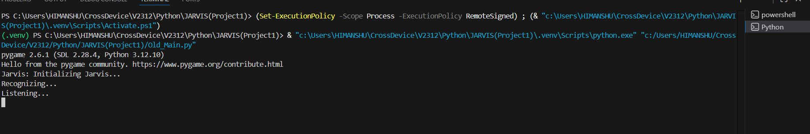
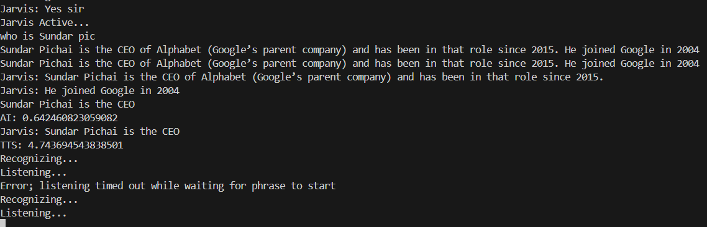
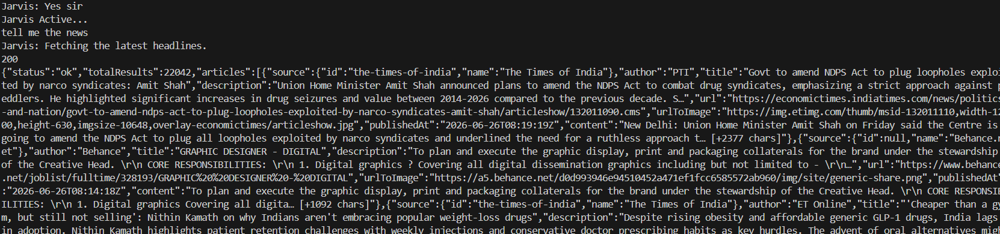
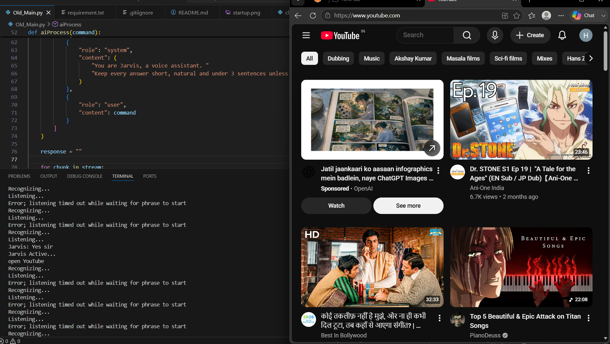

# 🎙️ Jarvis AI Voice Assistant

A Python-based AI Voice Assistant inspired by **Jarvis** from Iron Man.

This assistant can recognize voice commands, answer questions using AI, fetch the latest news, play music, and open websites using voice commands.

---

# 📌 Internship Details

- **Company:** CODTECH IT SOLUTIONS
- **Name:** Himanshu Kumar
- **Intern ID:** CITS3815  
- **Domain:** Python Programming
- **Task:** Task 1 – Desktop Assistant (Jarvis)
- **Duration:** 4 Weeks

---
## 📌 Project Status

**Version:** 1.0

This project is currently under active development. The current version supports voice commands, AI conversations, news updates, website automation, and music playback. More features are planned for future releases.

## 🚀 Features

- 🎤 Wake word detection ("Jarvis")
- 🗣️ Speech Recognition
- 🤖 AI-powered conversations using Groq API
- 🔊 Natural voice responses using Edge TTS
- 🌐 Open websites like:
  - Google
  - YouTube
  - Facebook
  - GitHub
  - LinkedIn
- 📰 Read the latest news headlines
- 🎵 Play songs from a custom music library

---

## 🛠 Technologies Used

- Python
- SpeechRecognition
- Edge-TTS
- Groq API
- NewsAPI
- Pygame
- Requests

---

## 📦 Installation

Clone the repository:

```bash
git clone https://github.com/YOUR_USERNAME/Jarvis-AI-Assistant.git
```
## 🎤 Voice Commands

Example commands:

- "Jarvis"
- "Open Google"
- "Open YouTube"
- "Tell me the news"
- "Play Skyfall"
- "Who is Sukuna?"

Go into the project folder:

```bash
cd Jarvis-AI-Assistant
```

Install the required libraries:

```bash
pip install -r requirements.txt
```

Run the assistant:

```bash
python main.py
```
---


---


## 📌 Future Improvements

- Streaming AI responses
- Conversation memory
- Weather updates
- Desktop application launcher
- Smart reminders
- GUI Interface

---

## 👨‍💻 Author

**Himanshu Kumar**

Python Developer | AI Enthusiast

# 📸 Screenshots

## Startup



---

## AI Conversation



---

## Latest News



---

## Opening Websites


---

## 🔑 API Keys

This project requires:

- Groq API Key
- NewsAPI Key

Create your own API keys and replace the placeholders in the source code before running the project.

---

## 📄 License

This project is intended for educational and portfolio purposes.